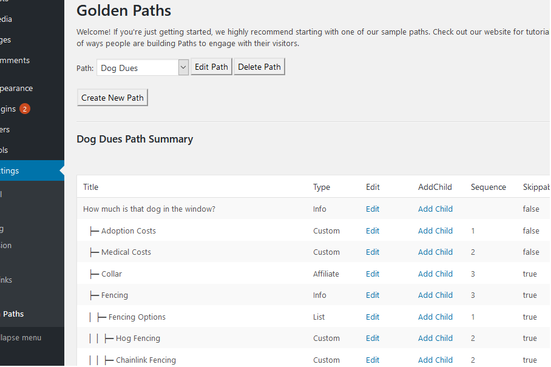
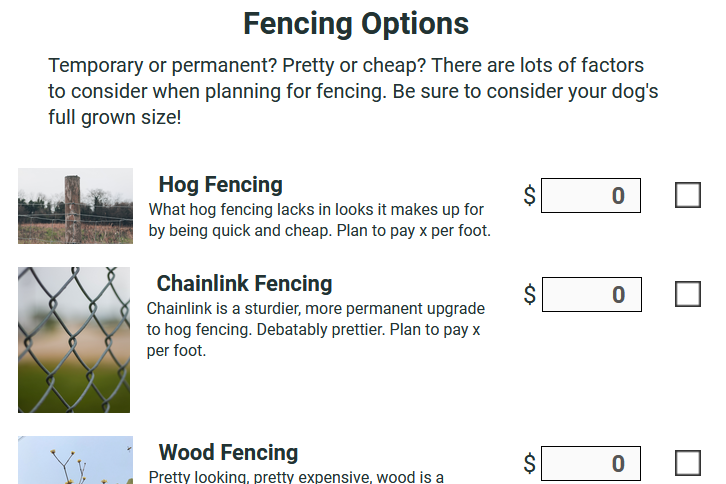

# GoldenPath

GoldenPaths is a WordPress Plugin for creating and rendering structured user flows (*Paths*) like Listicles, Buying Guides, How-To's, etc. 

Admins can quickly build new Paths with no HTML/CSS experience:

<kbd></kbd>

There are several page templates available from simple:

<kbd></kdb>

to complex:

<kbd></kbd>

At the end of each Path, visitors are presented with a summary of their choices, including any custom prices (budget scenario). Visitors can jump back and change their answers by clicking on a particular page or start over completely. 

To see Golden Paths in action, head over to our sample site, [Dog Dues](https://dogdues.com).

## Getting Started

These instructions will get you a copy of the project up and running on your local machine for *plugin* development. To use the plugin as is, skip to **deployment** for notes on installing in your wordpress instance.

### Prerequisites

* Wordpress Instance
    * Tested with Varuna Theme

* Selenium-Server

* (optional) Docker

* (optional) Jenkins

### Installing / Building

After syncing the repository, navigate to main/golden-paths and run 

    npm install

After making frontend code changes, run

    npm run build

## Deployment

To deploy to your wordpress installation, just copy /main/golden-paths to /wp-content/golden-paths, omitting any build related content like node_modules. Activate the plugin and create flows as needed.

## Running the tests

**Running Tests With Docker**

Currently only unit tests are supported by the container defined in *DockerFile*.  This is not enough coverage for a pull request, so it's not really useful yet.
TODO: make a docker image with full test environment so we can switch to CI and simplify setup. 

**Running Tests Locally**

* Configure codeception to point at your wordpress instance by modifying *test/.env.testing*
* Start selenium-server (only required for Client UI Tests)
* Create the following pages containing the specified shortcode (only required for Client UI Tests)
    * \kitchen, *[golden-paths path_title="KitchenStuff"]*
    * \listnode, *[golden-paths path_title=CookingStuff]*  
    * \SimpleTestPath, *[golden-paths path_title=SimpleTestPath]*
* See \test\scripts* directory for examples of running the tests locally.  

## Versioning

We use [SemVer](http://semver.org/) for versioning. For the versions available, see the [tags on this repository](https://github.com/DavidMorgan206/GoldenPaths/tags). 

## Authors

* **David Morgan** - [StradellaCreative](https://github.com/StradellaCreative)

## License

This project is licensed under the GPL License - see the [LICENSE.md](LICENSE.md) file for details

